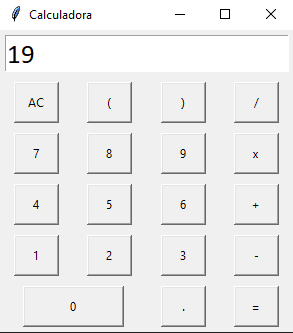

# Calculadora con Tkinter


Esta es una aplicación de calculadora simple construida con Python y Tkinter.

## Características
- Operaciones aritméticas básicas: suma, resta, multiplicación y división.
- Soporta paréntesis y puntos decimales.
- Botón de "AC" para reiniciar el cálculo.

## Capturas de Pantalla





## Cómo Ejecutar

1. **Clona el repositorio**:
   ```bash
   git clone https://github.com/tu-usuario/tkinter-calculator.git
2. **Navega al directorio del proyecto**:
   ```bash
   cd tkinter-calculator
   
4. **Ejecuta la calculadora**:
   ```bash
   python calculator.py
